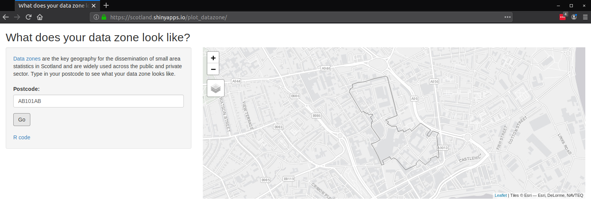

# plot_datazone
An R Shiny app: type in a postcode and see the corresponding datazone on a map.

The data zone for the given postcode is found by querying the SPARQL endpoint of [statistics.gov.scot](statistics.gov.scot). The data zone shapefile is then downloaded from [spatialdata.gov.scot](spatialdata.gov.scot).

